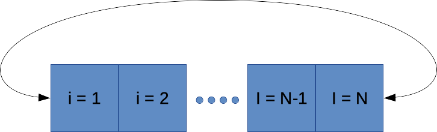
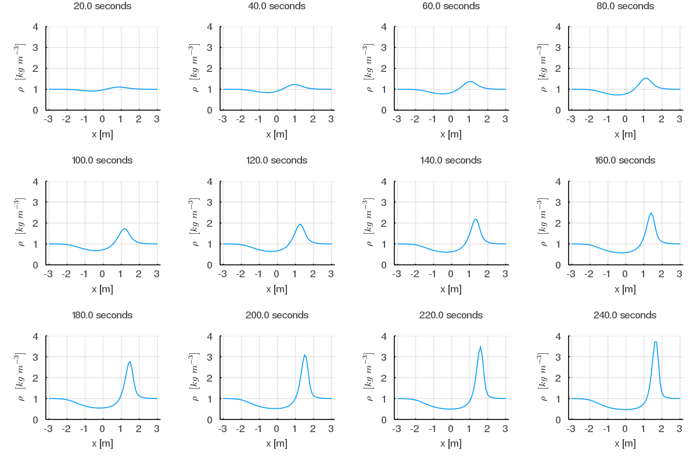
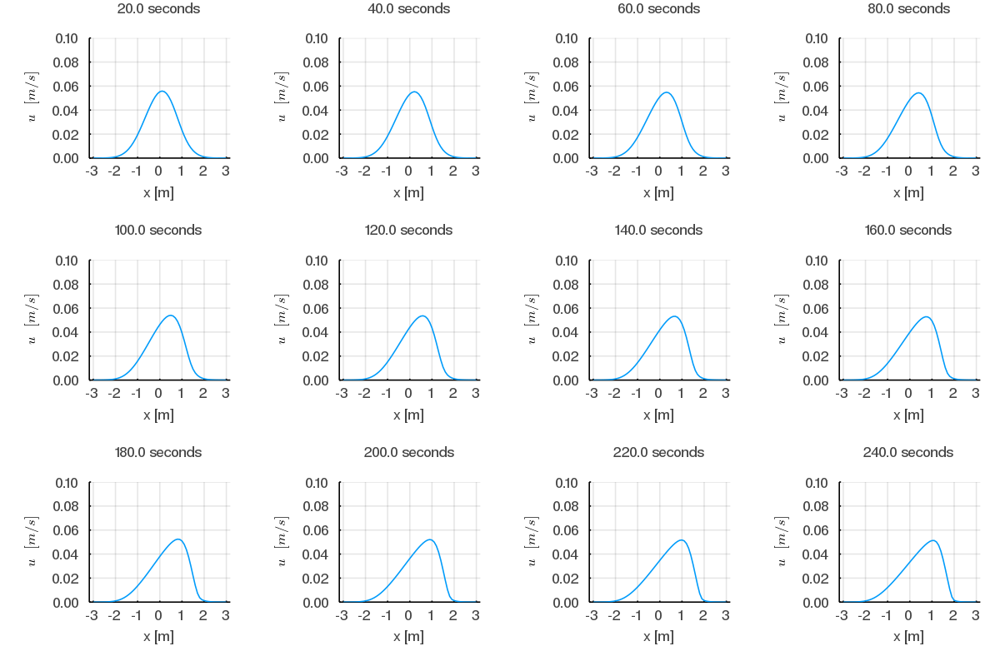

# CircularArrays

CircularArrays allow for the intuitive definition of circular domain composed of one or more faces, and each face has two directions for each dimension. After the definition of the connection between different faces, out-of-boundary indexes will be permitted. The CircularArray structure includes two fields - data array and connection array. The data array containing the data values and the connection array containing the information on the connections between faces and their sides.

## The connection array

The connection array is a four-dimensional array defining the connections between faces:
1. Face dimension - 1:(number of faces)
2. Spatial dimensions, size up to three - x=1, y=2, z=3
3. Direction, size 2 (negative direction = 1, positive direction = 2)
4. Destiny - four values pointing each (1) face, (2) dimension, and (3) direction to its neighbor. The fourth value (4) indicates whether there is a need to flip the face upside-down (0 - no-flip, 1 - flip).

### 1D, 1 face example

One face (size N) with one circular x dimention will have a 1x1x2x4 connection array where:  
connections[1,1,:,:]=  
 1  1  2  0  
 1  1  1  0  
 
 The first row (array indexes [1,1,1,:]) indicates that face one, x dimension, negative direction is pointing to face one, x-direction, positive direction. The second row (array indexes [1,1,2,:]) indicates that face one, x dimension, positive direction is pointing to face one, x-direction, negative direction. Array fliping is not relevant in 1D array and should be set to zero (connection[:,:,:,4]=0).
 

### 2D, 1 face example

One face (size NxN) with circular x and y dimentions will have a 1x2x2x4 connection array where:  
connections[1,1,:,:]=  
 1  1  2  0  
 1  1  1  0  
connections[1,2,:,:]=  
 1  2  2  0  
 1  2  1  0  
 
 connections[1,1,:,:] - The first row (array indexes [1,1,1,:]) indicates that face one, x dimension, negative direction is pointing to face one, x-direction, positive direction. The second row (array indexes [1,1,2,:]) indicates that face one, x dimension, positive direction is pointing to face one, x-direction, negative direction.  
 connections[1,2,:,:] -  The first row (array indexes [1,2,1,:]) indicates that face one, y dimension, negative direction is pointing to face one, y-direction, positive direction. The second row (array indexes [1,2,2,:]) indicates that face one, y dimension, positive direction is pointing to face one, x dimension, negative direction. No array fliping here.

## Use examples

### Diffusion 1D
Example examples/Diffusion_1D.jl will run a simple 1D diffustion equations: 

,  
where, ) is the density.

Using the embedded function shiftc which which returns a shifted value of the array, this example integrated for 12 seconds results:

### Advection 1D

Example examples/Advection_1D.jl will run a simple 1D Advection equations: 

%7D%7B%5Cpartial%20t%7D%20%3D%20-u%20%5Ccdot%20%5Cfrac%7B%5Cpartial%20(%20%5Crho%20%5Ccdot%20%5Cu)%7D%7B%5Cpartial%20x%7D)  

%7D%7B%5Cpartial%20x%7D)  

wherem ) and ) are the density and x-dimension velocity fields.

